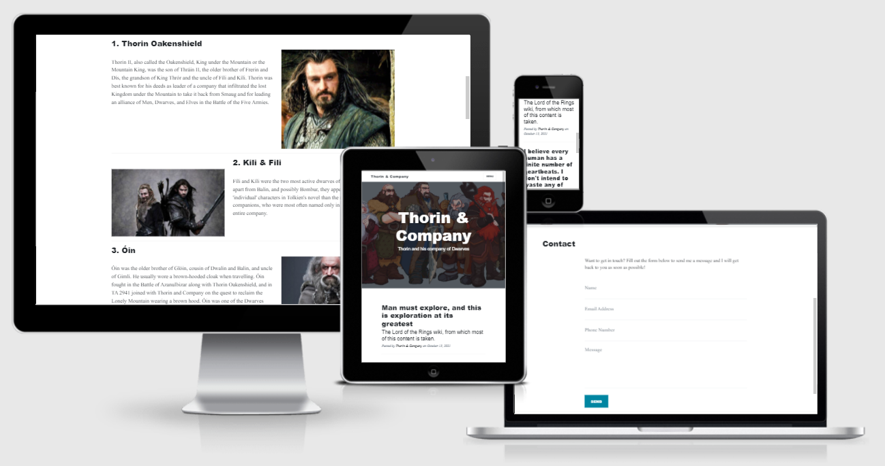

# **Thorin and Company**

# Overview
Code along with instructor to produce a Flask and Python based website which draws and manipulates data from JSON.  Learning outcomes include further understanding of the terminal and Git, as well as basic concepts relating to the Flask framework.

# Index
1. [UX](#ux)
1. [Features](#features)
    * [Existing Features](#existing-features)
    * [Features for Future Implementation](#features-for-future-implementation)
1. [Technologies Used](#technologies-used)
1. [Credits](#credits)
    * [Website](#website-credits)

## UX

### **Overview and Broad Design Choices**
The UX design for the project would have been undertaken by the Code Institute team.  The developer has added or tweaked content to personalise the project and make some features which would have been redundant relevant to the project.

## Features

### **Existing Features**
Features common to all pages/sections:
* Responsive nav and footer.
* All pages fully responsive to device size and scale accordingly.
* All interactive elements show hover/click functionality.

### **Features for Future Implementation**
1. Add actual form functionality and success/failure message for user on submit of contact form | At the moment no email is sent, but the page does give indication of such to the user.
1. Fix menu, two issues:
    1. The template has changed since the tutorial was created, and linking jQuery makes the sticky nav behave oddly.
    1. The hamburger menu does not work when the navbar collapses to tablet/mobile.
1. Replace images currently linked to with absolute urls to locally stored images with relative paths.  One of the image links supplied by the tutorial is already broken.

## Technologies Used

### **Languages**
* HTML5 is used to provide some of the content of the website.
  * About: [HTML5 Wiki](https://en.wikipedia.org/wiki/HTML5)
  * Creator: [W3 Consortium](https://www.w3.org/)
* CSS3 is used to provide most of the styling for the website.
  * About: [CSS3 Wiki](https://en.wikipedia.org/wiki/CSS)
  * Creator: [W3 Consortium](https://www.w3.org/)
* [Javascript](https://www.javascript.com/) provides some dynamic functionality.
* [Python](https://www.python.org/) is the primary programming language used to build the project.

### **Libraries and Frameworks**
* [Flask](https://flask.palletsprojects.com/en/2.0.x/) is the framework used to provide the structure for the website.
* [jQuery](https://releases.jquery.com/) is used to facilitate the integration of Javascript.
* [Bootstrap 5](https://getbootstrap.com/) is used to provide the grid functionality for uniform design, responsiveness and to enable the use of modal and hamburger menu.
* [Start Bootstrap - Clean Blog](https://github.com/StartBootstrap/startbootstrap-clean-blog/) template was used for the majority of the website styling.

### **Tools**
* [Heroku](https://www.heroku.com/) was used to deploy the project to the public domain.  This was achievd by linking the GitHub repository to Heroku once the project was presentable and utilising contiuous deployment thereafter.
* [Git](https://git-scm.com/)/[GitHub](https://github.com/) were used for version control and repository storage.
* [GitPod](https://www.gitpod.io/) was the IDE used to write the project.
* [Chrome Dev Tools](https://developers.google.com/web/tools/chrome-devtools) were used for specific responsiveness testing and drilling down into bug fixing.

### **Other Resources**
* [Code Institute Full Template](https://github.com/Code-Institute-Org/gitpod-full-template) was used to set up the repository.

## Credits

### **Website Credits**

#### Content
All content, including site images, provided by Code Institute, so the source of many resources are unknown, however:
* Site banner: [Art-Calvera via DeviantArt](https://www.deviantart.com/art-calavera/art/The-Hobbit-Thorin-and-Company-341472935)
* Majority of site content: [The One Wiki to Rule Them All](https://lotr.fandom.com/wiki/Thorin_II_Oakenshield)
* Replacement Thorin image: [Thorin Oakenshield Confession - Tumblr](https://thorinoakenshieldconfessions.tumblr.com/post/121430928250/1215-i-dont-know-how-these-things-are-done-but)

#### Media
The images for this README are from the following sources:
* Snips taken from GitHub.
* [Am I Responsive](http://ami.responsivedesign.is/).

#### Other
* Markdown basic taken from [Mastering Markdown](https://guides.github.com/features/mastering-markdown/).

**This website was produced as an educational project for the Code Institute Full Stack Development course.**

**Created by Amy Hacker.**

[Back to Top](#thorin-and-company)